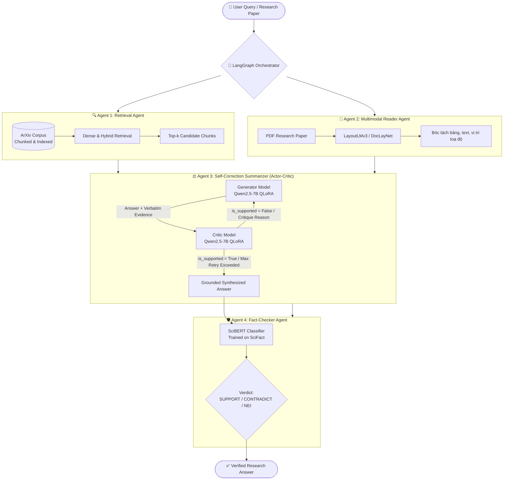

# 🔬 Multi-Agent Research Assistant: Autonomous Scientific RAG System

Agent 5 Writer v8: [bộ code, adapter, dữ liệu và kết quả đánh giá](writer_agent_v8_study/BAT_DAU_O_DAY.md). Ba file lớn của Writer được lưu bằng Git LFS; cài Git LFS trước khi clone để tải nội dung đầy đủ.

[](https://www.python.org/downloads/)
[](https://pytorch.org/)
[](https://huggingface.co/)
[](https://github.com/huggingface/peft)
[](https://github.com/langchain-ai/langgraph)
[](https://opensource.org/licenses/MIT)

Một hệ sinh thái **Multi-Agent RAG** chuyên sâu phục vụ nghiên cứu và phân tích bài báo khoa học (ArXiv Papers). Dự án giải quyết triệt để 3 vấn đề cố hữu của hệ thống RAG truyền thống:
1. **Ảo giác thông tin (Hallucination)** khi tổng hợp tài liệu khoa học phức tạp.
2. **Mất cấu trúc layout văn bản** (công thức, bảng biểu, biểu đồ, bài báo 2 cột) khi đọc PDF thô.
3. **Thiếu cơ chế tự phản biện nội bộ và kiểm chứng sự thật (Fact-checking)** trước khi trả về kết quả cho người dùng.

---

## 🏛️ System Architecture

Hệ thống hoạt động theo mô hình **Stateful Multi-Agent Workflow**, phân tách nhiệm vụ rõ ràng giữa 4 Agent chuyên biệt và một Orchestrator trung tâm:



---

## 🤖 Detailed Agent Breakdown

### 1. Agent 1: Retrieval Agent
- **Nhiệm vụ**: Lập chỉ mục và truy xuất ngữ cảnh chính xác từ corpus khoa học lớn.
- **Dữ liệu**: Bộ ngữ cảnh khoa học được phân đoạn (`ai-arxiv-chunked`), xử lý chuẩn hóa embedding và metadata.
- **Kỹ thuật**: Hybrid search kết hợp Dense Retriever và Re-ranking để lọc nhiễu trước khi nạp ngữ cảnh vào các Agent phía sau.

### 2. Agent 2: Reader / Document Layout Agent
- **Nhiệm vụ**: Phân tích bố cục tài liệu PDF phức tạp mà bộ bóc tách văn bản thông thường không làm được.
- **Model**: **LayoutLMv3** tinh chỉnh trên tập dữ liệu **DocLayNet**.
- **Khả năng**: Nhận diện tiêu đề, khối văn bản 2 cột, bảng biểu số liệu (Tables), và chú thích hình ảnh (Captions), duy trì trật tự đọc tự nhiên của bài báo.

### 3. Agent 3: Summarizer & Critic Agent (Core Innovation)
- **Kiến trúc**: **Dual-Model Actor-Critic Loop**. Thay vì gộp chung một mô hình, hệ thống chia thành 2 checkpoint độc lập:
  - **Generator (Qwen2.5-7B-Instruct + QLoRA)**: Tổng hợp câu trả lời và bắt buộc trích xuất bằng chứng nguyên văn (*Verbatim Evidence Span*).
  - **Critic (Qwen2.5-7B-Instruct + QLoRA)**: Phản biện độc lập, bắt lỗi suy diễn ngoài tài liệu (*Out-of-context reasoning*). Nếu phát hiện thiếu bằng chứng, Critic gửi phản hồi để Generator sinh lại.
- **Cơ chế Verbatim Validation**: Kiểm chứng xâu chuỗi cấp độ ký tự (`is_verbatim_match()`), từ chối mọi trường hợp paraphrase mập mờ.
- **Lối thoát an toàn (Safety Escape Hatch)**: Sau `MAX_INTERNAL_RETRY`, nếu vẫn chưa đạt được đồng thuận tuyệt đối, hệ thống trả về kết quả kèm cờ `confidence="low"` để bảo vệ tính trung thực.

### 4. Agent 4: Scientific Fact-Checker Agent
- **Nhiệm vụ**: Chốt chặn cuối cùng kiểm tra sự thật mang tính học thuật.
- **Model**: **SciBERT** (`allenai/scibert_scivocab_uncased`) được huấn luyện trên tập **SciFact**.
- **Cơ chế**: Gắn nhãn 3 trạng thái quan hệ suy luận tự nhiên khoa học (NLI):
  - `SUPPORT`: Luận điểm được chứng minh bằng tài liệu.
  - `CONTRADICT`: Luận điểm mâu thuẫn với tài liệu.
  - `NOT_ENOUGH_INFO (NEI)`: Tài liệu chưa đủ căn cứ xác thực.

---

## 📂 Repository Structure

```text
multi-agent-research-rag/
├── train_agent1_retrieval/         # Pipeline huấn luyện và index cho Agent 1
│   ├── kb_indexing/                # Corpus chunks và vector database
│   └── ...
├── train_agent2_reader/            # Pipeline xử lý layout PDF & Vision
│   ├── layoutlmv3_doclaynet_model/ # Checkpoint và tokenizer của LayoutLMv3
│   ├── reader_agent.py             # Agent bóc tách cấu trúc tài liệu
│   ├── reader_policy.py            # Quy chuẩn trích xuất bảng biểu / text
│   └── test_tool_layoutlmv3.py     # Unit test phân tích PDF
├── train_agent3_summarizer/        # Pipeline Generator + Critic của Agent 3
│   ├── generator/                  # Script train QLoRA cho Generator
│   ├── critic/                     # Script train QLoRA cho Critic
│   ├── data/                       # Dữ liệu SFT, validation và evaluation
│   │   ├── summarizer_eval_manual.jsonl  # 18 benchmark test cases viết tay
│   │   ├── eval_results.jsonl            # Trace suy luận của Generator & Critic
│   │   └── llm_judge_results.jsonl       # Kết quả chấm điểm LLM-as-a-Judge
│   ├── config.py                   # Cấu hình tập trung (paths, hyperparams)
│   ├── node.py                     # SummarizerNode đóng gói thành LangGraph node
│   ├── validate_evidence_span.py   # Bộ lọc Verbatim string matching
│   ├── merge_lora_weights.py       # Script merge standalone LoRA weights
│   ├── eval_generator_critic.py    # Benchmark định lượng offline trên GPU
│   └── llm_judge_eval.py           # LLM-as-a-Judge đánh giá tự động
└── README.md
```

---

## 📊 Benchmark & Evaluation Results

Chất lượng của hệ thống được kiểm định độc lập thông qua phương pháp **LLM-as-a-Judge** (sử dụng model giám khảo `openai/gpt-oss-120b` / GPT-4o với `temperature=0.0`) trên tập đánh giá thủ công 18 mẫu kiểm thử thuộc 6 paper nền tảng: **LoRA, Transformer, RAG, ReAct, QLoRA, DPO**.

### 1. Kết quả kiểm định từ Giám khảo độc lập (LLM Judge)

| Tiêu chí đánh giá | Số lượng | Tỷ lệ (%) | Ý nghĩa kỹ thuật |
| :--- | :---: | :---: | :--- |
| **Tổng số mẫu kiểm thử** | **18** | **100.0%** | Bao phủ câu hỏi chi tiết, suy luận sâu & câu hỏi gài bẫy |
| **Correct (Đúng hoàn toàn)** | **16** | **88.9%** | Trả lời chính xác bản chất, trích dẫn đúng nguyên văn |
| **Partially Correct** | **2** | **11.1%** | Đúng trọng tâm, tóm tắt cô đọng hơn đáp án mẫu |
| **Incorrect (Sai lệch)** | **0** | **0.0%** | **Không có câu trả lời nào sai lệch kiến thức** |
| **Bắt bẫy Unanswerable** | **6 / 6** | **100.0%** | **Tỷ lệ Hallucination = 0%** (từ chối an toàn khi thiếu context) |

### 2. Phân định môi trường huấn luyện (Engineering Trade-offs)

Do kích thước của mô hình `Qwen2.5-7B` khi nạp ở định dạng `bfloat16` cần tối thiểu ~15GB dung lượng đĩa và tài nguyên VRAM lớn:
- **Local Machine**: Chạy sinh dữ liệu, kiểm tra cú pháp, string-matching và LLM-as-a-Judge.
- **Kaggle / Cloud GPU (2x T4 16GB)**: Huấn luyện QLoRA 4-bit và thực thi quá trình Merge Adapter độc lập để tránh chạm ngưỡng giới hạn 20GB disk quota.

---

## 🚀 Quickstart & Installation

### 1. Yêu cầu môi trường
- Python >= 3.10
- GPU với VRAM >= 16GB (nếu chạy inference local cho 7B model)
- CUDA 12.1+

### 2. Cài đặt

```bash
# Clone repository
git clone https://github.com/tricong142/multi-agent-research-rag.git
cd multi-agent-research-rag

# Cài đặt virtualenv
python -m venv venv
source venv/bin/activate  # Trên Windows: venv\Scripts\activate

# Cài đặt dependencies
pip install torch torchvision --index-url https://download.pytorch.org/whl/cu121
pip install transformers peft bitsandbytes accelerate datasets langgraph
```

### 3. Cấu hình biến môi trường
Tạo file `.env` tại thư mục gốc:
```env
OPENAI_API_KEY=sk-...
GROQ_API_KEY=gsk-...
BASE_MODEL_NAME=Qwen/Qwen2.5-7B-Instruct
```

### 4. Thực thi Agent 3 (Summarizer & Critic Node)

```python
from node import SummarizerNode
from transformers import AutoModelForCausalLM, AutoTokenizer
import torch

# 1. Tải 2 checkpoint đã merge
generator_model = AutoModelForCausalLM.from_pretrained("checkpoints/generator_merged", torch_dtype=torch.bfloat16, device_map="auto")
critic_model = AutoModelForCausalLM.from_pretrained("checkpoints/critic_merged", torch_dtype=torch.bfloat16, device_map="auto")
tokenizer = AutoTokenizer.from_pretrained("checkpoints/generator_merged")

# 2. Khởi tạo Agent Node
agent = SummarizerNode(generator_model, tokenizer, critic_model, tokenizer)

# 3. Thực thi truy vấn có ngữ cảnh
context = "LoRA reduces the number of trainable parameters by 10,000 times and GPU memory requirement by 3 times..."
question = "LoRA giúp tối ưu tài nguyên phần cứng như thế nào?"

result = agent.run(context=context, question=question)
print("Answer:", result.answer)
print("Evidence Spans:", result.evidence_spans)
print("Is Supported:", result.is_supported)
print("Reasoning Trials:", len(result.reasoning_trace))
```

### 5. Chạy đánh giá chất lượng (LLM Judge)
```bash
cd train_agent3_summarizer
python llm_judge_eval.py
```

---

## 🛠️ Tech Stack

- **Foundational LLMs**: `Qwen/Qwen2.5-7B-Instruct`
- **Vision-Language / Document Layout**: `microsoft/layoutlmv3-base` (DocLayNet)
- **Fact-Checking Encoder**: `allenai/scibert_scivocab_uncased`
- **Fine-Tuning Framework**: PEFT, QLoRA, BitsAndBytes, Hugging Face TRL
- **Orchestration**: LangGraph, LangChain Core
- **Judge & Eval**: Groq (`openai/gpt-oss-120b`), OpenAI GPT-4o

---

## 👨‍💻 Author & Contributions
- **Author**: Tri Cong ([@tricong142](https://github.com/tricong142))
- Mọi đóng góp, mở issue hoặc pull request đều được hoan nghênh nhằm tối ưu hoá pipeline Multi-Agent phục vụ cộng đồng nghiên cứu AI.
