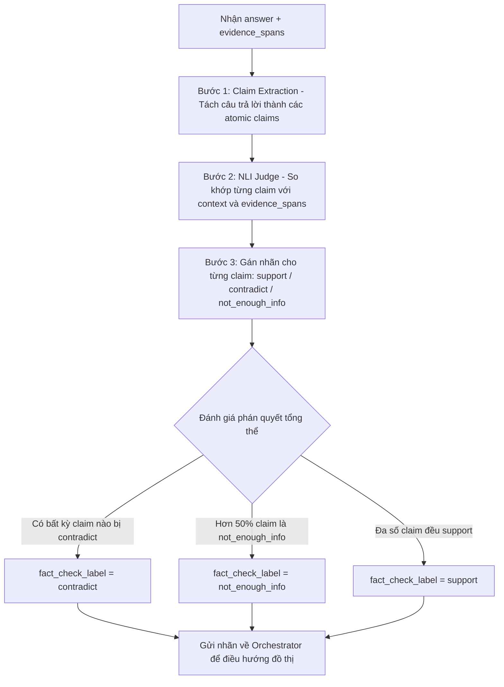

# TÀI LIỆU ĐẶC TẢ KỸ THUẬT: AGENT 4 - FACT-CHECKER AGENT
### Vị trí: Trọng tài thẩm định sự thật (Scientific Claim Verification & NLI Judge)
> **Người thực hiện:** Thành viên 4  
> **Thư mục làm việc độc lập:** `agents/agent4_fact_checker/`  
> **File bàn giao hệ thống:** `agents/agent4_fact_checker/node.py`  
> **Môi trường chạy mục tiêu:** Kaggle Notebook (GPU T4 x2) hoặc CPU/API

---

## 1. TỔNG QUAN NHIỆM VỤ & VỊ TRÍ KIẾN TRÚC

Fact-Checker Agent đóng vai trò là **"Vị thẩm phán độc lập"** trong toàn bộ hệ thống Multi-Agent RAG. Agent này đứng giữa Summarizer và Writer để kiểm duyệt chất lượng câu trả lời trước khi cho phép xuất báo cáo.

> [!IMPORTANT]
> **Vai trò then chốt trong đồ thị LangGraph:**
> Kết quả trả về của Fact-Checker (`fact_check_label`) là biến số **quyết định trực tiếp nhánh rẽ (Conditional Edge) của Orchestrator**:
> 1. `support`: Luận điểm đã được chứng minh đầy đủ $\rightarrow$ Cho phép chuyển tiếp sang **Agent 5 (Writer Agent)** để viết báo cáo.
> 2. `contradict` hoặc `not_enough_info`: Phát hiện luận điểm mâu thuẫn hoặc thiếu dữ cứ $\rightarrow$ Tăng `retry_count += 1` và **đẩy ngược toàn bộ quy trình về Agent 1 (Retrieval)** để tìm kiếm thêm dữ liệu mới.
> 3. Nếu `retry_count >= 3`: Kích hoạt **Escalation Node** xuất báo cáo cảnh báo tin cậy thấp.

---

## 2. HIỆN TRẠNG TỪ CODE CŨ & ĐỊNH HƯỚNG MỚI

- **Hiện trạng:** Trong các nhánh cũ (`branches/`), **Agent 4 hoàn toàn chưa có một dòng code nào** (nhóm trước mới chỉ ghi chú: *"Agent 4 dùng SciBERT trên SciFact..."*).
- **Phân tích kỹ thuật thực tế cho bạn:**
  Bạn có **2 lựa chọn kỹ thuật khả thi** để triển khai trên Kaggle T4:

### 🏆 Phương án A (Khuyến nghị cho T4x2): Fine-tune Mô hình Phân loại NLI (SciBERT / DeBERTa-v3)
- **Ưu điểm:** Mô hình rất nhẹ (~110M - 400M tham số), train trên 1 GPU T4 chỉ mất ~15-20 phút. Khi chạy inference cực nhanh (< 20ms), tiêu tốn chưa đến 1GB VRAM, có thể chạy kèm trên GPU của các agent khác mà không lo OOM.
- **Tập dữ liệu chuẩn:** **SciFact** (tập dữ liệu thẩm định luận điểm khoa học của AllenAI) hoặc **FEVER**.
- **Mô hình nền:** `allenai/scibert_scivocab_uncased` hoặc `cross-encoder/nli-deberta-v3-base`.
- **3 Nhãn đầu ra:**
  - `0`: `CONTRADICT` (Mâu thuẫn)
  - `1`: `NOT_ENOUGH_INFO` (Chưa đủ thông tin)
  - `2`: `SUPPORT` (Có căn cứ xác thực)

### 💡 Phương án B: LLM-as-a-Judge (Dùng Prompting có cấu trúc CoT)
- **Ưu điểm:** Không cần code train mô hình phân loại riêng, chỉ cần dùng prompt chain-of-thought so khớp `{claim, evidence}` thông qua Qwen2.5-7B hoặc Gemini API.
- **Nhược điểm:** Tốn thêm tài nguyên LLM và chậm hơn so với mô hình phân loại chuyên biệt.

---

## 3. HƯỚNG DẪN HUẤN LUYỆN SCIBERT TRÊN KAGGLE T4 (PHƯƠNG ÁN A)

Chạy trên Kaggle Notebook (chỉ cần 1 GPU T4):

### Cài đặt môi trường:
```bash
!pip install -q -U "transformers>=4.40.0" "datasets" "accelerate" "scikit-learn" "torch"
```

### Script tinh chỉnh mẫu (`finetuning/finetune_scibert_scifact.py` hoặc notebook `finetuning/finetune_agent4_kaggle.ipynb`):
```python
import torch
from datasets import load_dataset
from transformers import (
    AutoTokenizer,
    AutoModelForSequenceClassification,
    Trainer,
    TrainingArguments
)
from sklearn.metrics import accuracy_score, precision_recall_fscore_support

# 1. Tải dataset SciFact
dataset = load_dataset("mteb/scifact")

MODEL_ID = "allenai/scibert_scivocab_uncased"
tokenizer = AutoTokenizer.from_pretrained(MODEL_ID)

# 2. Tiền xử lý dữ liệu: Nối Premise (Chứng cứ) và Hypothesis (Luận điểm)
def preprocess_function(examples):
    # sentence1 = context/evidence, sentence2 = claim
    return tokenizer(
        examples["sentence1"],
        examples["sentence2"],
        truncation=True,
        max_length=256,
        padding="max_length"
    )

# 3. Nạp mô hình 3 nhãn phân loại
model = AutoModelForSequenceClassification.from_pretrained(MODEL_ID, num_labels=3)

# 4. Huấn luyện nhẹ nhàng trên 1 GPU T4
training_args = TrainingArguments(
    output_dir="./scibert_scifact_checkpoints",
    learning_rate=2e-5,
    per_device_train_batch_size=16,
    num_train_epochs=3,
    weight_decay=0.01,
    fp16=True, # Tận dụng Tensor Core của T4
    evaluation_strategy="epoch",
    save_strategy="epoch"
)
```

---

## 4. THUẬT TOÁN ĐIỀU PHỐI NỘI BỘ (3 BƯỚC)



### Quy tắc phán quyết tổng thể (`fact_check_label`):
1. **Ưu tiên bắt lỗi sai:** Chỉ cần xuất hiện dù chỉ 1 claim bị `contradict` $\rightarrow$ Nhãn tổng thể lập tức là `contradict`.
2. **Kiểm tra căn cứ:** Nếu không có mâu thuẫn nhưng số lượng claim bị thiếu căn cứ (`not_enough_info`) chiếm $> 50\%$ $\rightarrow$ Nhãn tổng thể là `not_enough_info`.
3. **Chấp thuận:** Khi toàn bộ luận điểm cốt lõi đều được chứng minh bởi chứng cứ $\rightarrow$ Nhãn tổng thể là `support`.

---

## 5. ĐẶC TẢ GIAO DIỆN `node.py`

File `agents/agent4_fact_checker/node.py` phải trả về đúng định dạng sau:

```python
from typing import Any
from core.base_agent import BaseAgent
from core.state import AgentState

class FactCheckerAgent(BaseAgent):
    def __init__(self, max_internal_retry: int = 2):
        super().__init__(name="FactCheckerAgent", max_internal_retry=max_internal_retry)
        # Nạp mô hình phân loại NLI hoặc bộ prompt LLM-as-judge
        
    def run(self, state: AgentState) -> dict[str, Any]:
        answer = state.get("answer", "")
        evidence_spans = state.get("evidence_spans", [])
        retrieved_docs = state.get("retrieved_docs", [])
        retry_count = state.get("retry_count", 0)
        
        # 1. Tách claims từ answer
        # 2. Đánh giá từng claim qua NLI
        # 3. Phán quyết nhãn tổng thể
        
        return {
            "claims": [
                "LoRA giúp giảm nhu cầu bộ nhớ GPU đi 3 lần so với GPT-3 175B."
            ],
            "verified_claims": [
                {
                    "claim": "LoRA giúp giảm nhu cầu bộ nhớ GPU đi 3 lần so với GPT-3 175B.",
                    "status": "support",          # "support" | "contradict" | "not_enough_info"
                    "confidence": 0.94,
                    "evidence": "LoRA can reduce ... GPU memory requirement by 3 times."
                }
            ],
            "fact_check_label": "support",        # Nhãn quyết định rẽ nhánh Orchestrator!
            "reasoning_trace": [
                {
                    "agent": self.name,
                    "fact_check_label": "support",
                    "claims_count": 1,
                    "supported_count": 1,
                    "reasoning": "Luận điểm đã được chứng minh bởi trích dẫn khoa học."
                }
            ]
        }
```

---

## 6. TIÊU CHÍ NGHIỆM THU (DEFINITION OF DONE)

- [ ] File `node.py` chạy độc lập thành công mà không gây lỗi.
- [ ] Phân tách được câu trả lời thành 1-3 atomic claims rõ ràng.
- [ ] Gán đúng nhãn: Phân biệt được câu có chứng cứ (`support`), câu mâu thuẫn (`contradict`) và câu thiếu chứng cứ (`not_enough_info`).
- [ ] Biến `fact_check_label` bắt buộc phải là một trong 3 giá trị chuỗi cố định: `"support"`, `"contradict"`, `"not_enough_info"`.
- [ ] Vượt qua 100% test cases trong `agents/agent4_fact_checker/tests/`.
